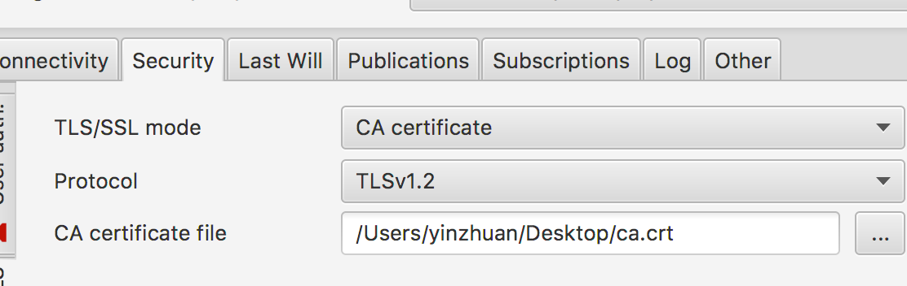

[Docker container](https://hub.docker.com/r/ypzhuang/mqtt/)

mosquitto on Ubuntu

1883:Plain MQTT protocol
8883:MQTT over TLS/SSL
9001:Plain WebSockets
9883:WebSockets over TLS/SSL

for the security ,you should remove ca.key,cisco.csr, ca.srlfiles in the dir /etc/mosquitto

for TLS/SSL connection(port on 8883), you should copy ca.crt file to your local dist.
Config as the picture. 

This is [mqtt-spy](http://kamilfb.github.io/mqtt-spy/), download [here](https://github.com/kamilfb/mqtt-spy/releases/download/mqtt-spy_v0.5.3/mqtt-spy-0.5.3-jar-with-dependencies.jar)

run docker:
docker run -d -p 1883:1883 -p 8883:8883 -p 9001:9001 -p 9883:9883 ypzhuang/mqtt 